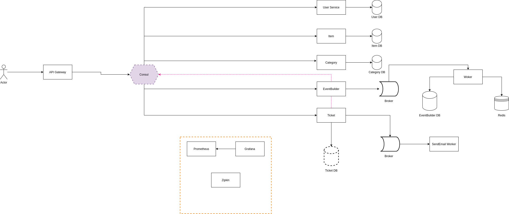

## This is a study case of a simple ticket application using microservices

### Stack
* Micronaut
* Kotlin
* Hibernate
* Docker
* RabbitMQ
* Postgres
* Zipkin with cassandra
* Consul
* Prometheus
* Grafana

## Bellow a short diagram explaining how is was implemented 
&nbsp;

&nbsp;

#### *Observability part is being implemented*